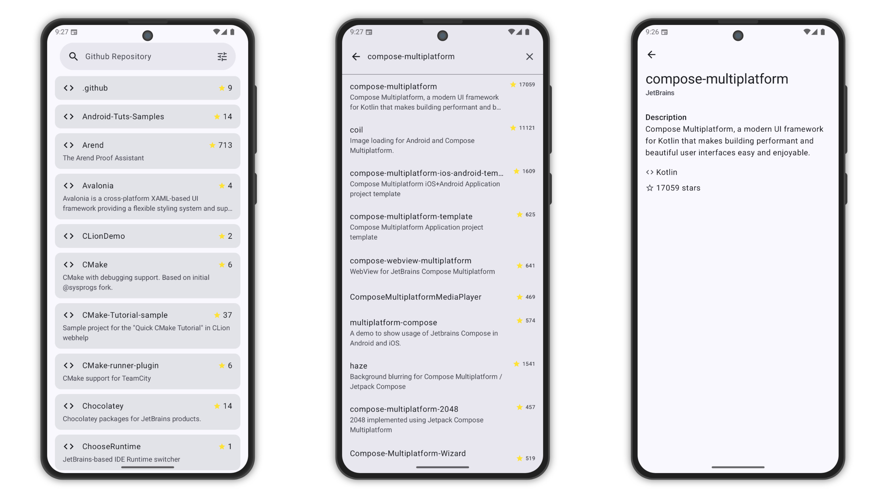

# Github Repository

Github Repository is a Kotlin-based mobile application that allows users to search for and explore
GitHub repositories. The app fetches real-time repository data from
the [GitHub REST API](https://docs.github.com/en/rest), provides offline support with Room database,
and features Google Sign-In along with Firebase Cloud Messaging for push notifications.

## **Screenshots**

<picture>
  <source media="(prefers-color-scheme: dark)" srcset="screenshots/screenshot-dark.png">
  <source media="(prefers-color-scheme: light)" srcset="screenshots/screenshot.png">
  
</picture>

## Features

### GitHub Repository Search

- Search public repositories.
- Display repository details such as name, description, language, and stars.

### Offline Caching

- Store searched repositories locally using Room Database.
- Allow access to previously viewed data without internet connection.

### Authentication

- Sign in using Google Sign-In via Firebase Authentication.

### Notifications

- Receive push notifications via Firebase Cloud Messaging (FCM).

## Architecture & Tech Stack

- **Clean Architecture with MVVM (Model-View-ViewModel)**
- **Ktor** for network communication
- **Room Database** for offline storage
- **Coroutines & Flow** for asynchronous and reactive programming
- **Koin** for dependency injection
- **Firebase** for authentication and messaging
- **Material Design Components** for a clean and responsive UI
- **Paging3** for efficient data pagination

## Installation & Setup

1. **Clone the repository**
   ```sh
   git clone https://github.com/yourusername/GitHubExplorer.git
   cd GitHubExplorer
   ```
2. **Add API Token (Optional but recommended to avoid rate limits)**
    - Add the following to `local.properties`:
      ```properties
      GITHUB_TOKEN=your_github_token_here
      ```
3. **Create a Keystore for Signing**
    - Navigate to the `app` directory and create a keystore file (`your-keystore.jks`).
    - This file is required for signing the application.
4. **Set up the Keystore Properties**
    - Create a `keystore.properties` file in the project's root directory and add the following
      values:
      ```properties
      storePassword=your-store-password
      keyPassword=your-key-password
      keyAlias=your-key-alias
      storeFile=your-keystore.jks
      ```
    - Ensure that the file is referenced correctly in `build.gradle` to fetch the keystore details.
5. **Configure Firebase**
    - Create a Firebase project.
    - Enable Google Sign-In and Firebase Cloud Messaging.
    - Download `google-services.json` and place it in the `app/` directory.
6. **Open the project in Android Studio**
7. **Sync Gradle and build the project**
8. **Run the app on an emulator or physical device**

## API Reference

The app uses the following endpoint:

```
https://api.github.com/users/{username}/repos
https://api.github.com/search/repositories
```

Refer to [GitHub API Docs](https://docs.github.com/en/rest) for more.

## FAQ

**Q: Explain the functionality**

The application allows users to browse public repositories from the JetBrains GitHub account using
the GitHub REST API. The user can log in using Google Sign-In, view a list of JetBrains
repositories, and search for specific repositories by name from the remote API. The app also caches
the repository data locally using Room to support offline access. Additionally, Firebase Cloud
Messaging is integrated to handle push notifications for user engagement.

**Q: What Components are used in the project?**

- **Jetpack Compose** for building a modern declarative UI
- **Ktor Client** for making HTTP requests to the GitHub API
- **Room Database** for local data caching
- **Paging 3** for efficient and seamless pagination of repository lists
- **Koin** for dependency injection and managing app modules
- **ViewModel + Kotlin Flow + Coroutines** for state management and asynchronous operations
- **Firebase Auth** for Google Sign-In
- **Firebase Cloud Messaging (FCM)** for push notifications

**Q: What architecture did you use and why do you think it’s best suitable?**

I implemented Clean Architecture combined with MVVM, which helps in creating a scalable, testable,
and modular application:

- **The Presentation Layer** uses Jetpack Compose with ViewModels to manage UI state and user
  interactions.
- **The Domain Layer** contains business logic and use cases, isolated from frameworks.
- **The Data Layer** abstracts the data sources (GitHub API via Ktor and Room DB).

This architecture clearly separates concerns, makes the codebase easier to maintain and test, and
ensures that the app is adaptable for future feature extensions, like switching data sources.

**Q: How do you ensure that code is testable?**

- Business logic is centralized in the Domain Layer with use cases and interfaces, which can be
  easily unit tested.
- Dependencies are injected using Koin, which supports easy replacement with mock/fake
  implementations during testing.
- ViewModels are tested for state updates using Kotlin Flow and Coroutines.
- UI logic is kept separate from Composables, which allows them to be previewed and tested in
  isolation.
- API and DB access are abstracted, allowing me to write tests for the Repository layer using fake
  data sources.

**Q: Is there any way that you can automate the deployment?**

Yes, since this project is hosted on GitHub, I’ve automated the deployment process using GitHub
Actions.

A CI workflow is already set up to run on every push or pull request to the master branch. This
workflow:

- Sets up the build environment with JDK 17
- Decodes the keystore and creates the keystore.properties file for signing
- Decodes the google-services.json from secrets to enable Firebase
- Builds the project using Gradle
- Distributes the release build via Firebase App Distribution to testers automatically

This ensures each commit is built, signed, and distributed consistently, helping reduce manual steps
and potential errors.

The workflow can also be extended in the future to:

- Run unit and UI tests
- Upload builds to Google Play Console
- Trigger builds based on tags or version bumps

## Contact

For any questions, feel free to reach out
at [mubashirpa2002@gmail.com](mailto:mubashirpa2002@gmail.com)